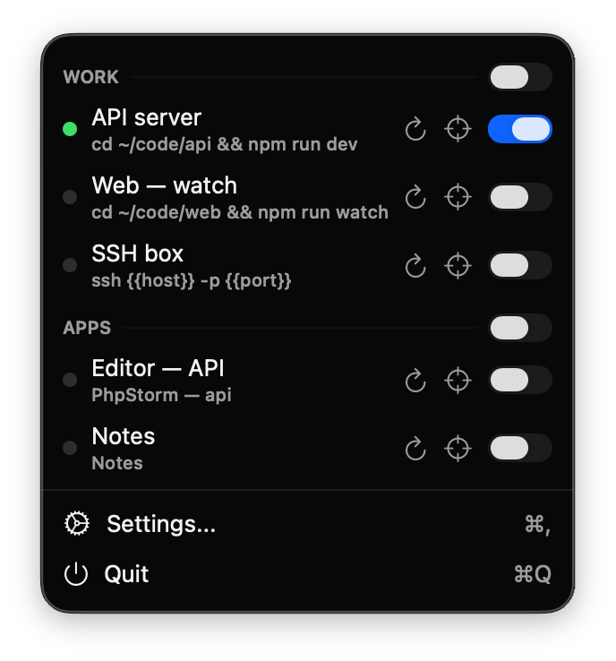
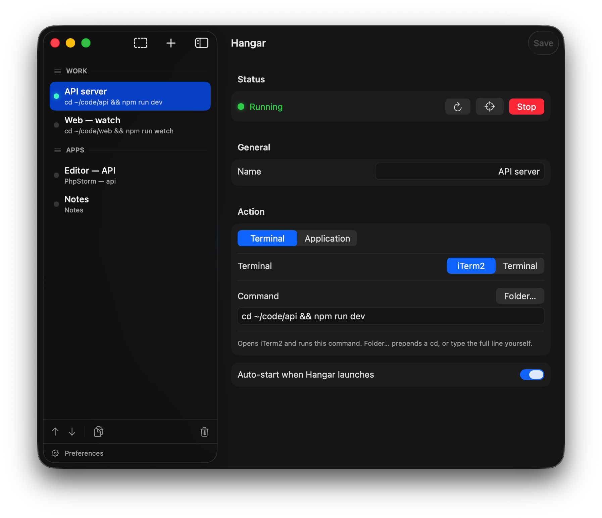

# Hangar

A lightweight macOS menu bar app that turns your terminal workflows into one-click, toggleable snippets. No electron, no bloat — native Swift and AppKit.

<p align="center">
  
</p>
<p align="center">
  
</p>

## Why?

You keep the same workflows running all day — a build/watch command in one project, a TUI you paste into in another — each pinned to a folder and a command, often parked on its own desktop. They're easy to lose track of, and after a restart you have to remember to start them all again.

Hangar keeps them as a compact list in the menu bar. Flip a toggle to open iTerm2 (or Terminal) and run the command; flip it off to close it. Mark the ones you want back automatically when you log in.

## Features

- **Menu bar app** — always accessible, no dock icon
- **Terminal snippets** — open iTerm2 / Terminal and run a command with one toggle
- **Application snippets** — launch an app, optionally opening a specific project or file with it (e.g. an IDE + a project folder)
- **Groups** — organize snippets with dividers and flip a whole group with one toggle
- **Auto-start on login** — your pinned workflows come back after a restart
- **Native macOS** — drives your real terminal via AppleScript; no bundled shell, no reinvented terminal

## Why not just…?

Hangar fills a narrow gap: a **glanceable, toggleable menu-bar list of pinned workflows with live status**. The usual alternatives are great at adjacent problems but don't quite do that:

- **Shell aliases / a `.zshrc` zoo** — fast to run, but invisible. Nothing reminds you they exist, there's no on/off, and after a reboot you re-launch each one from memory. Hangar keeps them as a visible list you flip on, with auto-start on login.
- **Raycast / Alfred** — excellent *fire-and-forget* launchers: they trigger a command and forget it. Hangar *holds* it — a persistent toggle with a live running dot that even notices when you close the window yourself.
- **tmux / tmuxinator** — powerful session managers, but terminal-only and config-file driven. Hangar drives your *real* iTerm2 / Terminal windows (your profile, fonts, scrollback) and also launches GUI apps + opens a project in your IDE.
- **iTerm2 arrangements / Shortcuts.app** — restore windows or run a script, but neither gives you a menu-bar surface with per-workflow status and group toggles.

And it stays out of the way: native Swift/AppKit, no Electron, no embedded terminal, no dock icon, no account — just a menu-bar item. MIT-licensed and free.

## Build from source

```bash
cd Hangar
xcodebuild -scheme Hangar -configuration Release
```

Requires Xcode 15+ and macOS 14+.

## Usage

1. Click the Hangar icon in the menu bar.
2. Open **Settings** and add a snippet:
   - **Terminal** — choose iTerm2 or Terminal and enter a command. Use **Folder…** to prepend a `cd`, or type the full line yourself.
   - **Application** — choose an app, and optionally a project or file to open with it.
3. Toggle the snippet from the menu bar. Mark **Auto-start** to bring it back on login.

On first launch macOS asks to let Hangar **control** your terminal (Automation) — that's how it opens a window and runs your command. Allow it once.

## License

MIT
